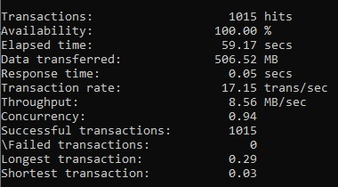
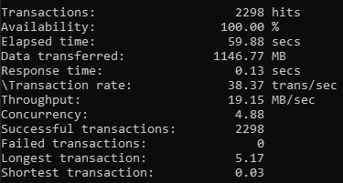
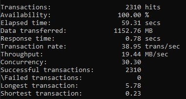
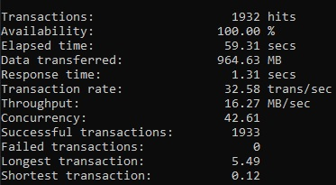
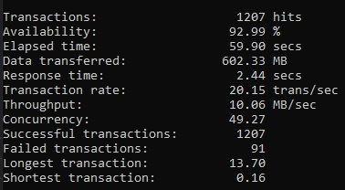
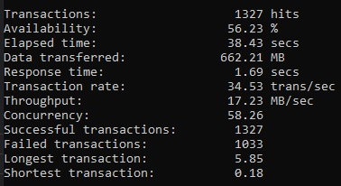

```
siege -c25 -t60S http://127.0.0.1:8889  
```
  
```
siege -c25 -t60S http://127.0.0.1:8889  
```
  
```
siege -c50 -t60S http://127.0.0.1:8889  
```
  
```
siege -c60 -t60S http://127.0.0.1:8889  
```
  
```
siege -c65 -t60S http://127.0.0.1:8889  
```
P.S: problem with sock.c:
socket: unable to connect sock.c:230: Address family not supported by protocol  
socket: unable to connect sock.c:230: No such file or directory  
  
```
** siege -c100 -t60S http://127.0.0.1:8889  
```
P.S: problem with sock.c:
socket: unable to connect sock.c:230: Address family not supported by protocol  
socket: unable to connect sock.c:230: No such file or directory  
  
